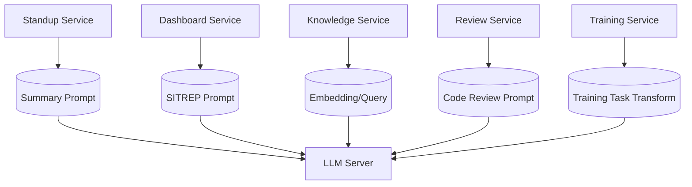
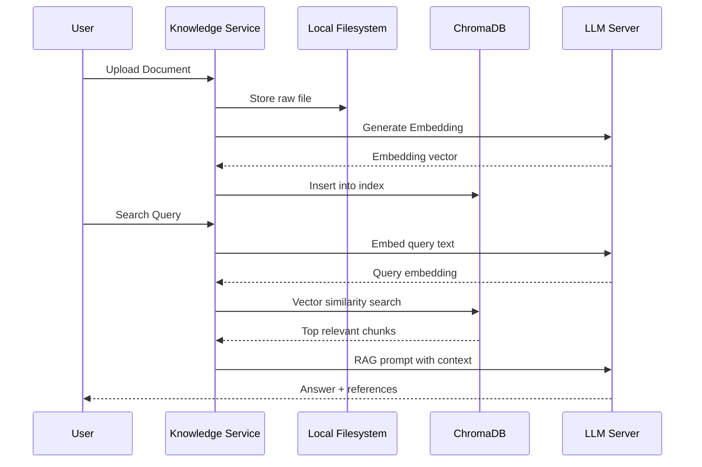
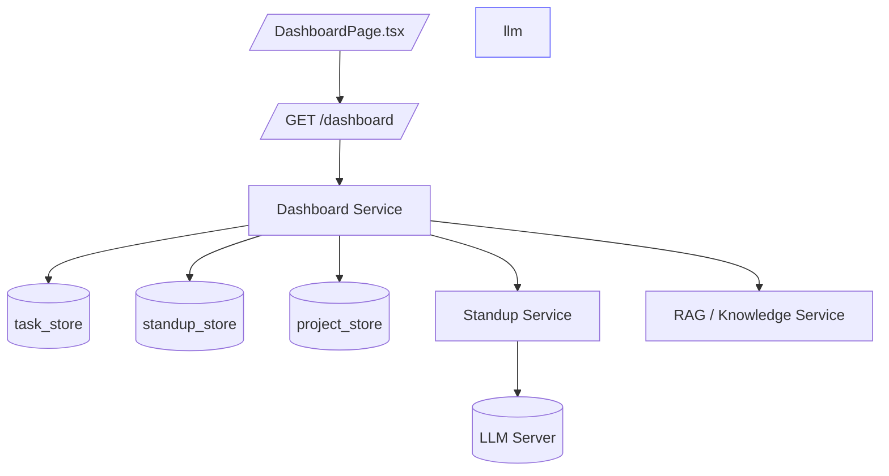
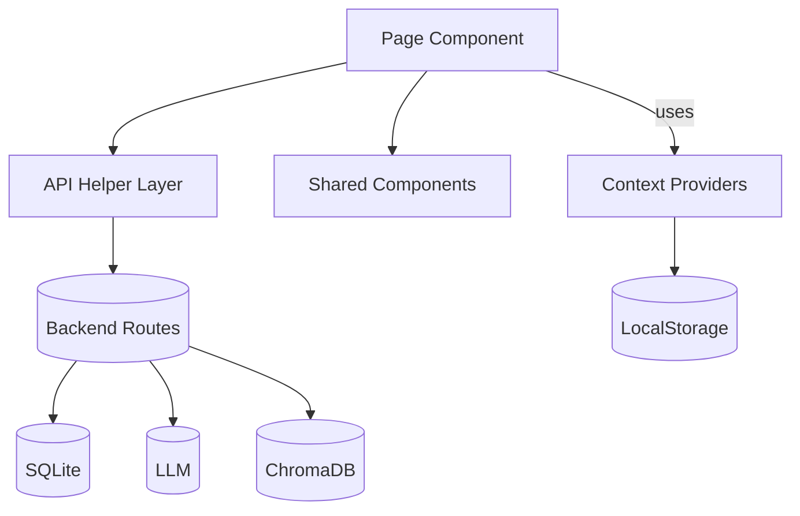
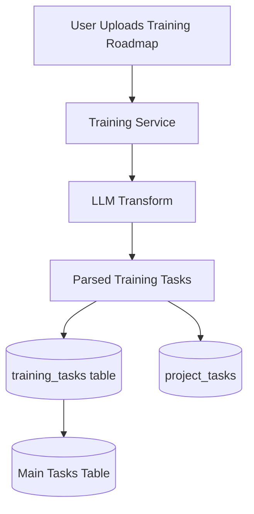
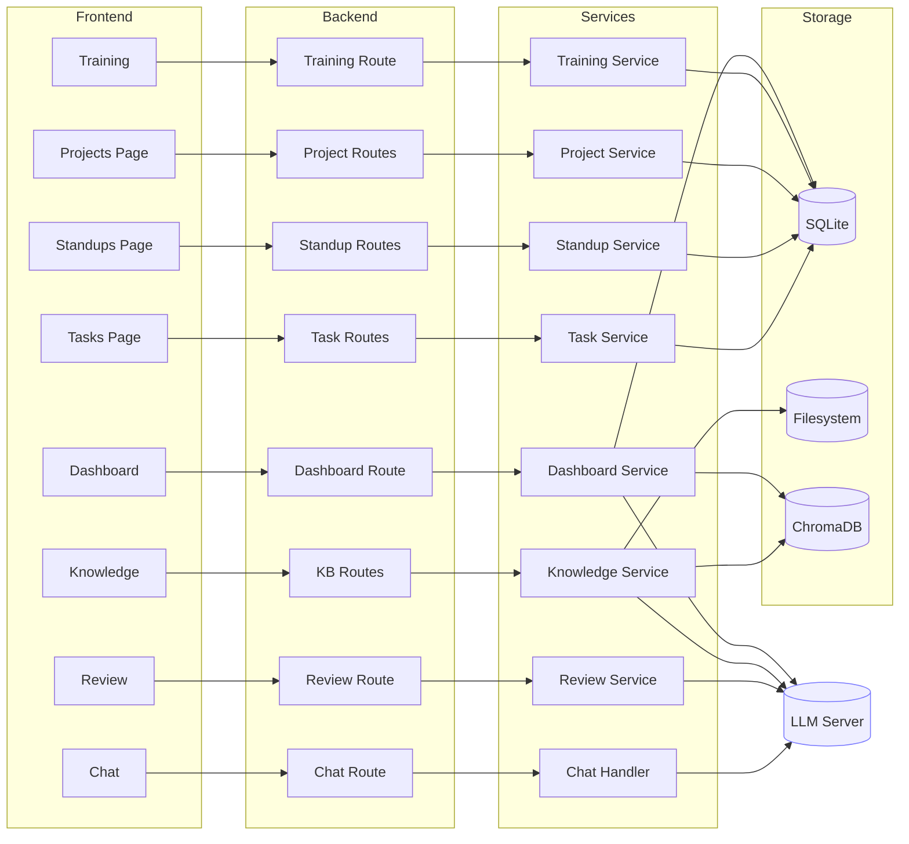

# System Architecture Diagrams

This document provides a visual overview of DevCell’s system architecture,
including backend modules, frontend views, data flow, and LLM/RAG pipelines.
Diagrams use Mermaid syntax for readability and maintainability.

---

# 🏗️ 1. High-Level System Overview

```mermaid
flowchart TD
    A[Frontend<br>React + TS] -->|REST API| B[Backend<br>FastAPI Services]
    B --> C[SQLite<br>Local Database]
    B --> D[ChromaDB<br>Embeddings]
    B --> E[LLM Server<br>(Ollama / LM Studio)]
    B --> F[Filesystem<br>Knowledgebase Docs]

    C --- G[(projects, tasks, standups, users, project_members, training_tasks)]
````

**Key points:**

* All backend logic flows through FastAPI services.
* LLM integrations are isolated but shared across modules.
* Knowledgebase uses both filesystem + ChromaDB.
* SQLite is the single source of truth for relational data.

---

# 🧩 2. Backend Module Interaction Diagram

```mermaid
flowchart LR

    subgraph API Routes
        AR1[/tasks/]
        AR2[/projects/]
        AR3[/standups/]
        AR4[/knowledge/]
        AR5[/dashboard/]
        AR6[/auth/]
        AR7[/review/]
        AR8[/training/]
    end

    subgraph Services
        S1[Task Service]
        S2[Project Service]
        S3[Standup Service]
        S4[Knowledge Service]
        S5[Dashboard Service]
        S6[Auth Service]
        S7[Review Service]
        S8[Training Service]
    end

    subgraph Stores
        ST1[(task_store)]
        ST2[(project_store)]
        ST3[(project_members_store)]
        ST4[(standup_store)]
        ST5[(knowledge_store)]
        ST6[(user_store)]
        ST7[(training_store)]
    end

    AR1 --> S1 --> ST1
    AR2 --> S2 --> ST2 & ST3
    AR3 --> S3 --> ST4
    AR4 --> S4 --> ST5
    AR5 --> S5
    AR6 --> S6 --> ST6
    AR7 --> S7
    AR8 --> S8 --> ST7
```

**Notes:**

* Services always sit between API routes and stores.
* The Dashboard service aggregates from multiple stores.
* Knowledgebase service interacts with Chroma + filesystem instead of a store.

---

# 🤖 3. LLM Usage Diagram



LLM Server may be:

* LM Studio
* Ollama
* vLLM container
* Remote (if allowed)

---

# 📚 4. Knowledgebase RAG Pipeline Diagram



---

# 📂 5. Project Permissions Model Diagram

```mermaid
flowchart TD
    U[User] --> PM[project_members<br>(project_id, username, role)]
    PM --> P[Projects]
    PM --> T[Tasks]

    P --> T

    style PM fill:#ffd,stroke:#333
```

**Interpretation:**

* A user’s project membership controls visibility/edit permissions.
* Tasks always inherit project-level access.
* Project owners can modify membership; members cannot.

---

# 📊 6. Dashboard Data Flow Diagram



Dashboard aggregates:

* Today’s standup
* Active tasks
* Recent tasks
* Recent standups
* Project summaries
* Optional SITREP (LLM)

---

# 🧭 7. Frontend Data Flow Diagram (React)



---

# 🗃️ 8. Training Pipeline Diagram



Used when onboarding new operators or building structured programs.

---

# 🔮 9. Full System Overview (Compressed Mermaid)



---

# 📚 Related Documents

* Backend Architecture → `backend.md`
* Frontend Architecture → `frontend.md`
* LLM Integration → `llm_integration.md`
* Modules → `../modules/*`
* API Reference → `../api/*`

---

```
© DevCell Platform Documentation — GitHub OSS Style
```