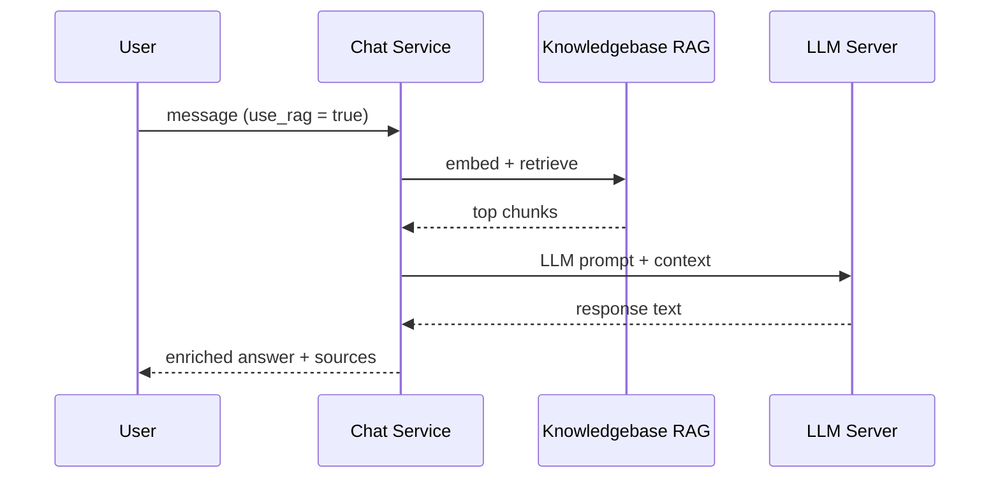

# Chat Module

The Chat module provides an interface for interacting with the local Large
Language Model (LLM) through a familiar chat UI. It supports:

- freeform Q&A  
- technical debugging  
- writing assistance  
- contextual conversation with project or KB grounding  
- RAG-enhanced responses  
- developer persona modes (optional)  

This document details the Chat architecture, backend logic, LLM prompt flow,
frontend UI, and planned enhancements.

---

# 🎯 Purpose

The Chat module allows DevCell users to:

- ask questions  
- obtain LLM-generated assistance  
- leverage the internal KB (documents + embeddings)  
- perform retrieval-augmented operations  
- simulate AI pair-programming for developers  

It functions like an internal, secure ChatGPT—but entirely local.

---

# 🧱 Data Model

Currently, the Chat module **does not store chat history in the database**.

Reasons:
- operational security  
- lightweight architecture  
- temporary testing phase  

Future enhancements may include:
- persistent chat threads  
- project-scoped chat  
- shared team chat rooms  

---

# 🧩 Backend Architecture

Backend chat logic exists in:

```

routes/chat.py
services/chat_service.py
knowledgebase/rag.py
core/llm_client.py

````

---

## 📁 1. Routes (`routes/chat.py`)

Main endpoint:

| Method | Endpoint | Purpose |
|--------|----------|---------|
| POST | `/api/chat` | Send user message to LLM (optional RAG) |

Example request payload:

```json
{
  "message": "Explain malware loader design",
  "use_rag": true,
  "notes": "Focus on defensive analysis"
}
````

Route handles:

* authentication
* optional RAG toggle
* passing conversation to service

---

## 🧠 2. Service Layer (`chat_service.py`)

Core responsibilities:

### (1) Message Normalization

* trim whitespace
* protect against empty queries
* detect multi-line blocks

### (2) Persona Selection (optional)

Backend can detect context based on:

* developer intent (code blocks)
* analysis intent (keywords)
* general chat

Each persona uses a different system prompt.

### (3) RAG Decision

If `use_rag = true`:

1. embed user query
2. query Chroma
3. retrieve top chunks
4. assemble RAG context block
5. modify the LLM prompt to include KB references

### (4) LLM Interaction

Calls `llm_client.send([...])` with:

```
system: persona / instructions
context: optional knowledgebase chunks
user: message
```

### (5) Response Formatting

* wrap answer
* include a "Sources" section if using RAG
* return JSON to frontend

---

# 📚 RAG Workflow (Chat)

Full sequence diagram:



RAG provides:

* better grounding
* fewer hallucinations
* highly relevant responses

---

# 🧠 Persona Profiles

The Chat service supports lightweight personas via system prompts:

### **1. General Assistant**

Default.

```
Helpful, concise assistant with professional tone.
```

### **2. Developer Mode**

Triggered by presence of code blocks or terms like “FastAPI”, “React”, “TypeScript”.

```
Act as a senior software engineer. Provide code, patterns, and architecture.
```

### **3. Cyber Analyst Mode**

Triggered by terms like “malware”, “analysis”, “TTP”.

```
Provide defensive, safe, controlled responses for malware analysis.
```

### **4. Documentation Mode**

Triggered by words like “write explanation”, “summarize”, “document”.

```
Produce structured, markdown-based documentation.
```

Personas adjust:

* tone
* output format
* safety constraints

---

# 🖥️ Frontend Architecture

Frontend chat lives in:

```
src/pages/ChatPage.tsx
src/components/ChatInput.tsx
src/components/ChatMessage.tsx
src/components/ChatHistory.tsx
src/lib/chat.ts
```

### ChatPage

* main chat window
* state holds visible messages
* scroll-to-bottom behavior
* RAG toggle switch

### ChatInput

* text box
* handles enter/shift+enter
* maintains multi-line input
* sends POST to `/api/chat`

### ChatMessage

* renders assistant/user messages
* code block formatting
* markdown rendering
* shows “Sources” section if RAG used

### lib/chat.ts

Implements:

* `sendMessage()`
* type definitions
* error reporting

---

# 🔐 Permissions

Current system:

* all authenticated users may use Chat
* no project restrictions
* no history stored

Future versions may support:

* project-scoped chats
* team chat rooms
* admin-moderated logs

---

# 🧪 Use Cases

### Technical Support

“Help me debug my Python script.”

### Knowledge Retrieval (RAG)

“What does the malware training roadmap recommend in Week 4?”

### SITREP Assistance

“Draft a mission summary for today.”

### Developer Mode

“Refactor this FastAPI router for clarity.”

### Documentation

“Write module-level documentation for task service.”

---

# 🛑 Error Handling

Chat service handles:

* unreachable LLM server
* invalid RAG chunks
* empty messages
* oversized prompts

Graceful fallback:

* disable RAG if KB fails
* return error message without crashing frontend

---

# 🔮 Future Enhancements

### 1. Persistent Chat Threads

Saved per user or per project.

### 2. Project-Scoped AI Agents

Assistants aware of project tasks, standups, and docs.

### 3. Inline Code Execution (sandboxed)

### 4. Conversation Search

### 5. Auto-RAG Enhancement

Model automatically decides when to use the KB.

### 6. Multi-modal support

Images + code snippets.

---

# 📚 Related Documents

* LLM Integration → `architecture/llm_integration.md`
* Knowledgebase Module → `knowledge.md`
* Dashboard Module → `dashboard.md`
* Permissions Model → `permissions.md`
* API Reference → `../api/chat_api.md`

---

```
© DevCell Platform Documentation — GitHub OSS Style
```